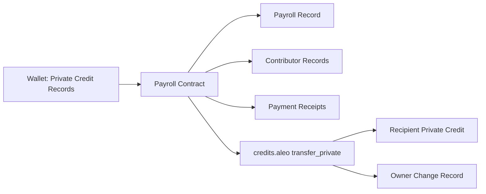
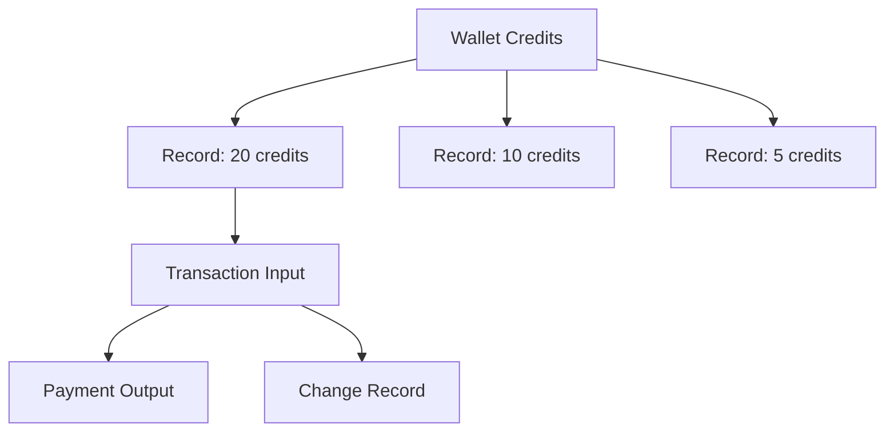
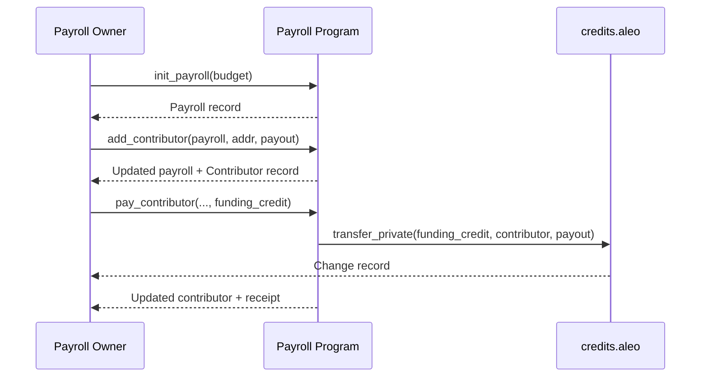

# Confidential Payroll on Aleo

Privacy-preserving payroll coordination powered by Aleo records and zero-knowledge execution.

[](https://aleo-payroll-9vo6-git-main-anxbts-projects.vercel.app/)
[](https://www.youtube.com/watch?v=GiL_80iWzkg)

> Replace the two placeholder URLs above with your real links.

## Why This Project
Traditional on-chain payroll leaks sensitive information:
- Contributor identities
- Payment amounts
- Treasury allocation patterns

Confidential Payroll enforces payroll rules without exposing private financial details.

## What It Does
- Create private payroll budgets
- Register contributor payout commitments
- Execute private payouts with deterministic checks
- Support batch payout flows for multiple contributors
- Optionally disclose aggregate spent amount

## Core Guarantees
For every payout, the contract enforces:
- Caller is payroll owner
- Contributor belongs to payroll
- Contributor is not already paid
- Funding credit is sufficient
- Budget constraints are respected

## System Architecture



## Record Model
Aleo uses record objects (UTXO-style), not a single mutable account balance.



This is why batch payout needs multiple funding records as inputs.

## Contract Workflow



## Data Privacy Model
### Private
- Contributor identities (inside records)
- Payout amounts
- Funding credit records
- Allocation order and internal state

### Public
- Transaction existence
- Program execution metadata

## Frontend Highlights
- Wallet connect (Shield + Leo adapters)
- Payroll dashboard with status and record refresh
- Single payout and batch payout UX
- Real-time transaction status polling

## Known Constraints
- Record-based funding means batch payouts need multiple spendable funding records
- Wallet record decryption may require user approval depending on wallet permission mode
- Testnet reliability can occasionally affect deployment/broadcast timing

## Tech Stack
- Leo (Aleo program)
- Aleo testnet + credits.aleo
- Next.js + TypeScript frontend
- Provable wallet adapters

## Repository Structure
```text
contracts/
  src/main.leo
  tests/

front-end/
  src/app/
  src/hooks/
  src/lib/
  src/types/
```

## Local Development
### 1) Contract
```bash
cd contracts
leo test
```

### 2) Frontend
```bash
cd front-end
pnpm install
pnpm dev
```

## Production Notes
- Program currently deployed as `payroll_rishav_v3.aleo`
- If function signatures change, deploy with a new program name (upgrade compatibility rules apply)

## Use Cases Beyond Payroll
- DAO contributor compensation
- Grant disbursement
- Bounty payouts
- Research funding allocation
- Private treasury operations
